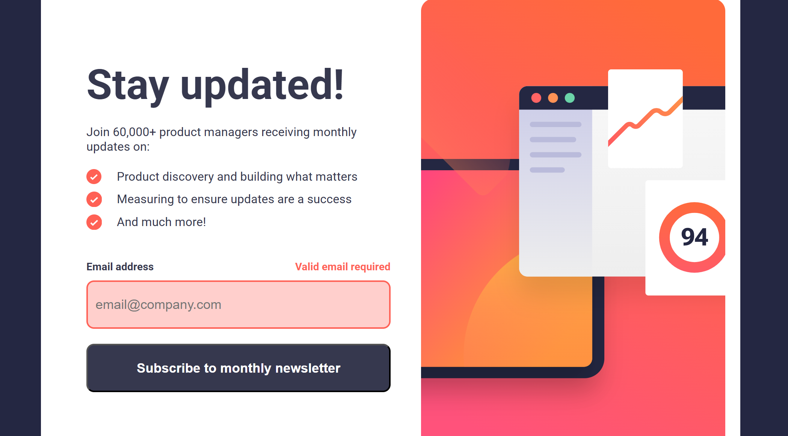
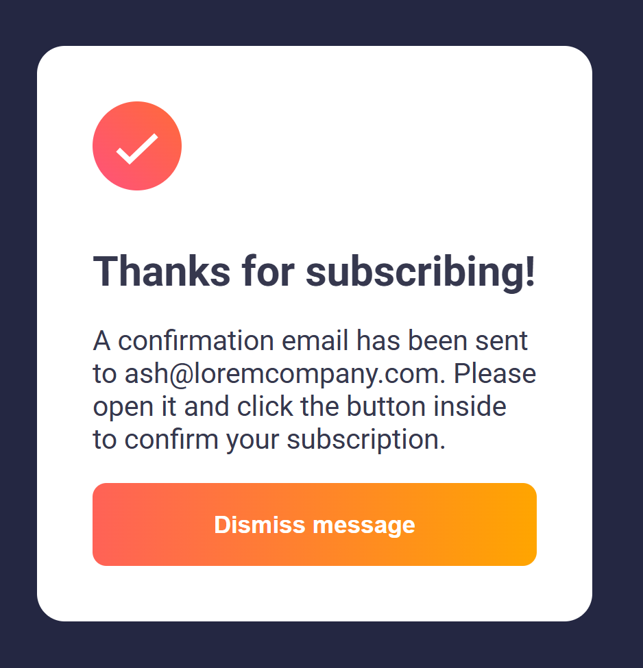

# Frontend Mentor - Newsletter sign-up form with success message solution

This is a solution to the [Newsletter sign-up form with success message challenge on Frontend Mentor](https://www.frontendmentor.io/challenges/newsletter-signup-form-with-success-message-3FC1AZbNrv). Frontend Mentor challenges help you improve your coding skills by building realistic projects. 

## Table of contents

- [Overview](#overview)
  - [The challenge](#the-challenge)
  - [Screenshot](#screenshot)
  - [Links](#links)
- [My process](#my-process)
  - [Built with](#built-with)
  - [What I learned](#what-i-learned)

## Overview

### The challenge

Users should be able to:

- Add their email and submit the form
- See a success message with their email after successfully submitting the form
- See form validation messages if:
  - The field is left empty
  - The email address is not formatted correctly
- View the optimal layout for the interface depending on their device's screen size
- See hover and focus states for all interactive elements on the page

### Screenshot





### Links

- Solution URL: [https://github.com/hrong1/Newsletter-sign-up-form-with-success-message](https://github.com/hrong1/Newsletter-sign-up-form-with-success-message)
- Live Site URL: [https://hrong1.github.io/Newsletter-sign-up-form-with-success-message/](https://hrong1.github.io/Newsletter-sign-up-form-with-success-message/)

## My process

### Built with

- Semantic HTML5 markup
- CSS custom properties
- Flexbox
- CSS Grid
- Mobile-first workflow

### What I learned

use `@keyframes` make the animation for the input box

```css
@keyframes shake {
    0%, 100% {
        transform: translateX(0);
    }
    10%, 30%, 50%, 70%, 90% {
        transform: translateX(-1rem);
    }
    20%, 40%, 60%, 80% {
        transform: translateX(1rem);
    }
}

.shake {
    animation: shake 0.5s ease-in-out;
}
```
